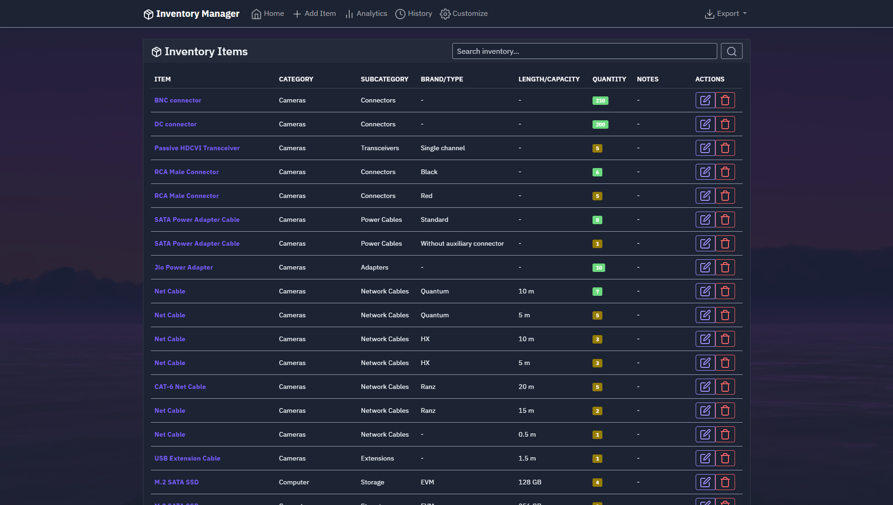
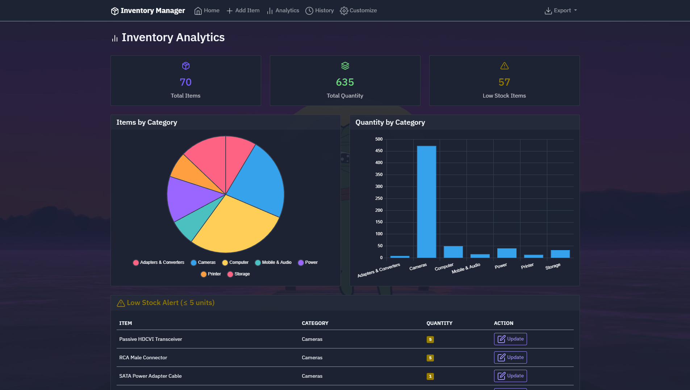
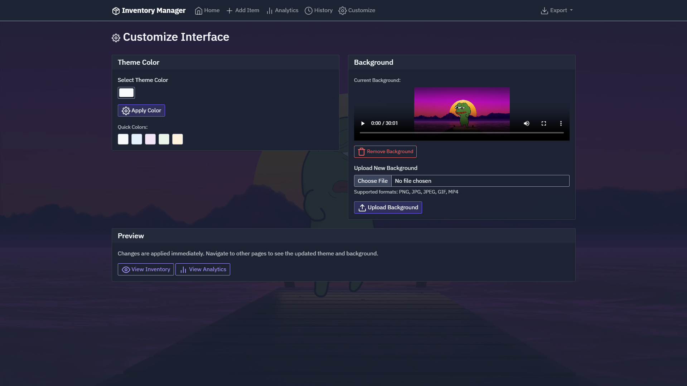
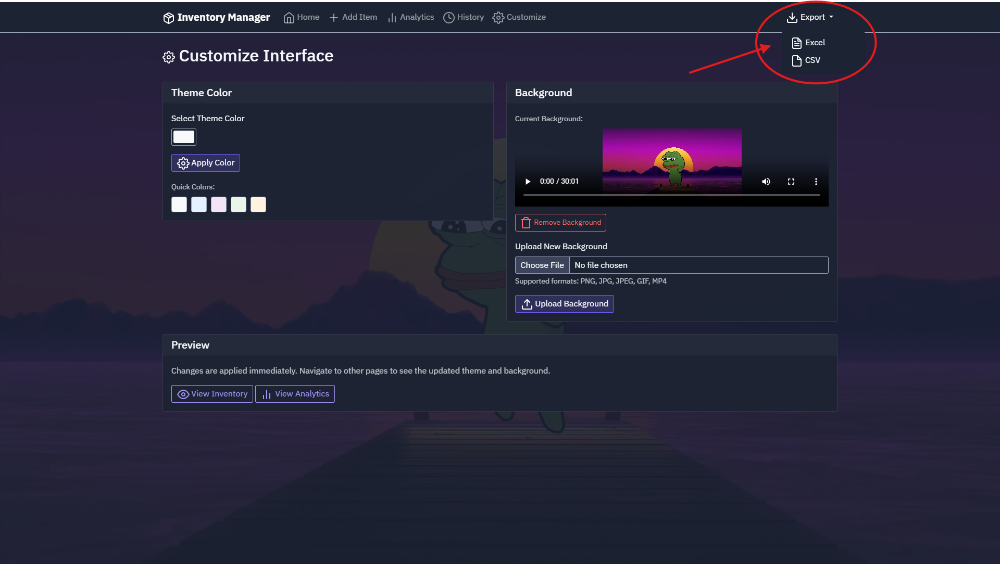

# StockPilot

## Overview
This is a Flask-based inventory management system designed for personal or small business use. The application provides a comprehensive web interface for tracking inventory items with full CRUD operations, analytics, history tracking, and customization features. It uses Excel files for data storage and includes a responsive Bootstrap dark theme interface with customizable backgrounds and theme colors.

## Application Workflow

Here is a visual guide to the application's features and workflow:

### 1. Home Dashboard
The central hub of the application where users can view the entire inventory list. It features real-time search capabilities, quick edit/delete actions, and status indicators for stock levels.

### 2. Add New Item
A dedicated interface for inputting new inventory. Users can specify categories, subcategories, brand details, and quantity.

### 3. Analytics
Visual insights into your inventory. This section displays charts for category distribution and automatically flags low-stock items (≤ 5 units) that need replenishment.

### 4. History Tracking
A comprehensive audit trail that logs every action taken within the system (additions, updates, removals) with precise timestamps to ensure accountability.

### 5. Customization
Users can personalize the look and feel of the application by selecting theme colors and uploading custom background images or videos (supports mp4).

### 6. Export Data
The system allows for easy data portability. Users can export their current inventory snapshot to Excel or CSV formats via the dropdown menu.

---

## System Architecture

### Web Framework
- **Flask**: Lightweight Python web framework chosen for its simplicity and quick development cycle
- **Bootstrap Dark Theme**: Provides responsive, modern UI with dark mode styling
- **Feather Icons**: Clean, consistent iconography throughout the interface

### Data Storage
- **Excel-based Storage**: Uses pandas to manage inventory data in `inventory.xlsx` format
- **CSV History Logging**: Tracks all inventory actions in `history.csv` for audit trails
- **File-based Media Storage**: Static files stored in `static/backgrounds/` directory
- **Schema**: Inventory items contain Category, Subcategory, Item, Brand/Type, Length/Capacity, Quantity, and Notes fields

### Frontend Architecture
- **Server-side Rendering**: Jinja2 templates with base template inheritance
- **Responsive Design**: Bootstrap grid system with mobile-first approach
- **Dynamic Backgrounds**: Supports both image and video backgrounds with opacity overlay
- **Real-time Search**: Client-side filtering capabilities for inventory items
- **Analytics Dashboard**: Visual representation of inventory data with charts and summary cards

### Core Features
- **CRUD Operations**: Complete Create, Read, Update, Delete functionality for inventory items
- **History Tracking**: Comprehensive logging of all inventory changes with timestamps
- **Search and Filter**: Dynamic inventory search across all fields
- **Analytics**: Summary statistics, low stock alerts, and category-based insights
- **Customization**: Theme color selection and background media upload
- **Data Export**: Excel file download capabilities for backup and reporting

### Security and Configuration
- **Environment-based Secrets**: Session key configurable via environment variables
- **File Upload Validation**: Strict file type checking for media uploads (images: png, jpg, jpeg, gif; videos: mp4)
- **Secure Filename Handling**: Uses Werkzeug's secure_filename for upload safety
- **Directory Management**: Automatic creation of required directories on startup

## External Dependencies

### Python Packages
- **Flask**: Web framework and routing
- **pandas**: Excel file manipulation and data processing
- **Werkzeug**: Secure file handling utilities
- **openpyxl**: Excel file reading/writing (pandas dependency)

### Frontend Libraries
- **Bootstrap**: CSS framework from cdn.replit.com with agent dark theme
- **Feather Icons**: Icon library from cdn.jsdelivr.net
- **JavaScript**: Vanilla JS for client-side interactions and form handling

### File System Dependencies
- Local file storage for inventory.xlsx, history.csv, and uploaded background media
- Static file serving through Flask's built-in capabilities
- No external database or cloud storage dependencies
